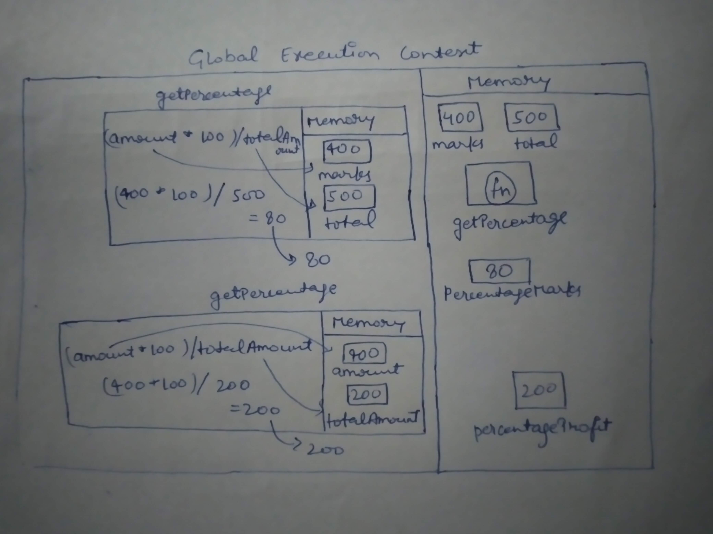

1. What does thread of execution means in JavaScript?

JavaScript engine executing code line by line is known as thread of execution

2. Where the JavaScript code gets executed?

In Global Execution Context

3. What does context means in Global Execution Context?

Context is an environment in which the code get executed.

4. When do you create a global execution context.

Global Execution Context is created once for a program.

5. Execution context consists of what all things?

Memory, to store the data and other section to execute functions

6. What are the different types of execution context?

Global Execution Context and Function Execution Context

7. When global and function execution context gets created?

Global Execution Context is created once for a program while Function Execution Context is created for each function in program.

8. Function execution gets created during function execution or while declaring a function.

Function execution gets created during function execution.

9. Create a execution context diagram of the following code on your notebook. Take a screenshot/photo and store it in the folder named `img`. Use `` to display it here.

```js
var user = "Arya";

function sayHello() {
  return `Hello ${user}`;
}

var userMsg = sayHello(user);
```

<!-- Put your image here -->


```js
var marks = 400;
var total = 500;

function getPercentage(amount, totalAmount) {
  return (amount * 100) / totalAmount;
}

var percentageMarks = getPercentage(marks, total);
var percentageProfit = getPercentage(400, 200);
```

<!-- Put your image here -->



```js
var age = 21;

function customeMessage(userAge) {
  if (userAge > 18) {
    return `You are an adult`;
  } else {
    return `You are a kid`;
  }
}

var whoAmI = customeMessage(age);
var whoAmIAgain = customeMessage(12);
```

<!-- Put your image here -->


